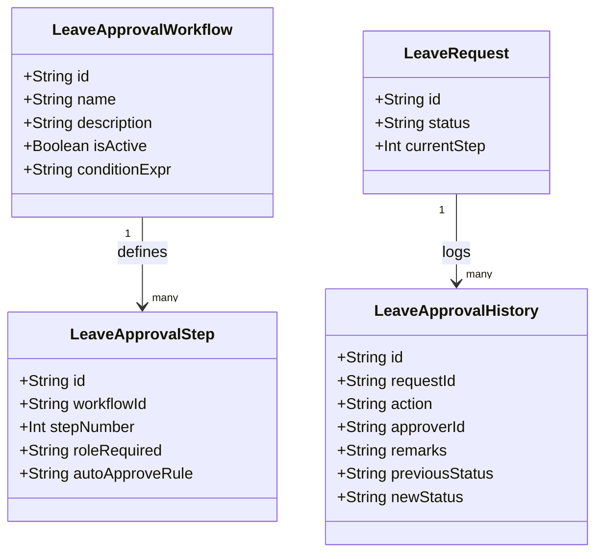

# Phase 3B Design: Multi-Level Leave Approval Workflow

This document outlines the detailed architecture and system specifications for Phase 3B of the **AHH WFM** monorepo system.

---

## 1. Approval Models & Database Schemas

We will introduce dynamic approval workflow rules, step definitions, and history ledgers to allow configurable multi-level sign-offs.



### 1.1 Proposed Prisma Schema Extensions

```prisma
// New LeaveApprovalWorkflow Model
model LeaveApprovalWorkflow {
  id            String              @id @default(uuid())
  name          String
  description   String?
  isActive      Boolean             @default(true)
  conditionExpr String?             // JSON condition string e.g., '{"leaveType": "ANNUAL"}'
  createdAt     DateTime            @default(now())
  updatedAt     DateTime            @updatedAt
  steps         LeaveApprovalStep[]
}

// New LeaveApprovalStep Model
model LeaveApprovalStep {
  id           String                 @id @default(uuid())
  workflowId   String
  workflow     LeaveApprovalWorkflow @relation(fields: [workflowId], references: [id], onDelete: Cascade)
  stepNumber   Int                    // Sequential order: 1, 2, 3...
  roleRequired String                 // "SUPERVISOR" | "MANAGER" | "HR"
  autoApprove  Boolean                @default(false)
  createdAt    DateTime               @default(now())
  updatedAt    DateTime               @updatedAt

  @@unique([workflowId, stepNumber])
}

// New LeaveApprovalHistory Model
model LeaveApprovalHistory {
  id             String       @id @default(uuid())
  leaveRequestId String
  leaveRequest   LeaveRequest @relation(fields: [leaveRequestId], references: [id], onDelete: Cascade)
  approverId     String?      // Nullable for system-triggered auto-approvals
  action         String       // "SUBMIT" | "APPROVE" | "REJECT" | "ESCALATE" | "REMIND" | "AUTO_APPROVE"
  remarks        String?      @db.Text
  previousStatus String
  newStatus      String
  createdAt      DateTime     @default(now())
}
```

---

## 2. Approval Chains Definition

The workflow engine evaluates matching workflows on request submission:
1.  **Supervisor Only:** Requires check-off only from the employee's assigned direct supervisor.
2.  **Supervisor $\rightarrow$ Manager:** Routes to supervisor, and upon approval, elevates to manager.
3.  **Supervisor $\rightarrow$ Manager $\rightarrow$ HR:** Standard path for long-term leaves (e.g., Annual Leave > 5 days).
4.  **Custom Chains:** Scoped by department or employee grade (e.g., Director leaves route directly to HR).

---

## 3. Auto-Approval Rules

On submission, the system evaluates the request payload against auto-approval criteria:
*   **Business Travel $\le$ 1 Day:** Automatically approved by the system.
*   **Emergency Leave $\le$ 4 Hours:** Autoresolves without manual manager check-off.
*   **Configurable Thresholds:** Configured via the `conditionExpr` in `LeaveApprovalWorkflow` using query expressions.

---

## 4. Escalation and Reminders Rules

To prevent requests from stalling in approval queues, background cron triggers execute escalation rules:
*   **Escalation Thresholds:**
    *   **Pending > 24 Hours:** System logs an `ESCALATE` action, triggers a slack/email notification reminder, and highlights the card on the supervisor's dashboard.
    *   **Pending > 72 Hours:** Automatically escalates the step to the next level (e.g., Supervisor $\rightarrow$ Manager) with remarks stating `"System escalated due to inactivity"`.
*   **Reminder Events:** Triggers automated daily notifications for supervisors with items still pending.

---

## 5. Timeline Tracking

Every step logs an audit trail in the `LeaveApprovalHistory` table tracking:
*   **Approver ID** (e.g., supervisor email, or `"SYSTEM"`).
*   **Action** (e.g. `APPROVE`, `REJECT`).
*   **Remarks / Comments** provided by the reviewer.
*   **Previous and New status states** (e.g. `PENDING_SUPERVISOR` $\rightarrow$ `PENDING_MANAGER`).

---

## 6. Notifications Framework

Designed with adapter hooks for pluggable dispatch providers:
*   **Mobile Push Notifications:** Triggered to alert employee of status changes or alert supervisors of new pending tasks.
*   **Email System:** Sends HTML summary emails for approvals.
*   **SAP Readiness:** Queues synchronization events to the outbound SAP ledger whenever leave status changes to `APPROVED` or `REJECTED`.

---

## 7. REST API Design

### 7.1 Approval Actions
*   `POST /api/v1/leaves/approve`
    *   **Payload:** `{ requestId: string, remarks?: string }`
    *   **Behavior:** Elevates the request to the next step, updates `currentStep` on `LeaveRequest`, and updates the request state. If final step, sets status to `Approved`.
*   `POST /api/v1/leaves/reject`
    *   **Payload:** `{ requestId: string, remarks: string }`
    *   **Behavior:** Flags the request as `Rejected` immediately, reverts any pending leave balances, and logs to approval history.

### 7.2 History & Configuration
*   `GET /api/v1/leaves/history?requestId=...` — Returns approval history timeline logs.
*   `GET/POST /api/v1/approval-workflows` — Admin endpoints to list and define custom approval chains.

---

## 8. UI Impact Design

### 8.1 Web Command Center (`apps/web`)
*   **Approvals Queue with Filters:** Separate queues for `Direct Approvals` (assigned to current session user role) and `Escalated Approvals` (flagged due to inactivity).
*   **Interactive History Timeline:** A vertical stepper tracking who approved when, what comments they left, and highlight markers for auto-approvals or escalations.
*   **Escalation Indicators:** Red alert badges showing days/hours elapsed since submission.

### 8.2 Mobile Client (`apps/mobile`)
*   **Progress Stepper:** A visual timeline on the employee's request status page showing where the request is currently sitting (e.g. Checked by Supervisor $\rightarrow$ Pending Manager $\rightarrow$ HR).
*   **Rejection Card:** Highlight cards showing rejection reasons and remarks left by the reviewer.

---

## 9. Migration Strategy

1.  **Schema Upgrades:** Deploy new tables (`LeaveApprovalWorkflow`, `LeaveApprovalStep`, and `LeaveApprovalHistory`).
2.  **Seed Workflows:**
    *   Create a default 3-level workflow for Annual Leave.
    *   Create a default 1-level workflow for Sick and Emergency Leave.
    *   Create an auto-approve workflow for Business Travel.
3.  **Retroactive Requests Map:** Assign existing resolved requests in `LeaveRequest` a mock historical log entry of type `INITIAL` to prevent referential errors.

---

## 10. Testing Strategy

*   **Custom Chains Test:** Define a 2-step chain (Supervisor $\rightarrow$ HR). Verify that a request submitted by `AM-8821` is not visible to HR until the Supervisor approves.
*   **Auto-Approval Validation:** Submit a Business Travel request of 0.5 days. Ensure it immediately enters an `Approved` status with status logs.
*   **Escalation Validation:** Mock the system time of a request to be 3 days in the past. Trigger the escalation script and verify it automatically reassigns the request step.
