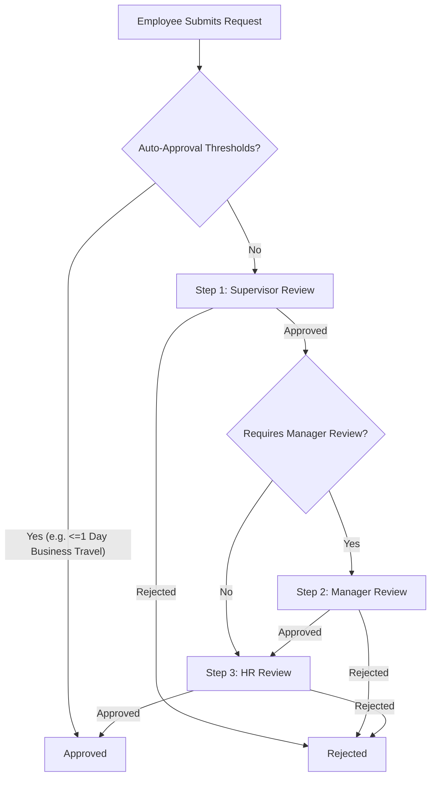

# Phase 3 Design: Leave Balances, Accruals, Multi-Level Approvals & Holiday Calendar

This document outlines the detailed architecture and system specifications for Phase 3 of the **AHH WFM** monorepo system.

---

## 1. Architectural Blueprint & Requirements

### 1.1 Leave Types & Configuration
To support both standard leave categories and client-configurable rules (e.g., specific site allowances), we introduce a dynamic `LeaveType` configuration model.

**Supported Leave Categories:**
1.  **Annual Leave:** Standard paid vacation, accruable, supports carry-forward and expiration.
2.  **Sick Leave:** Protected sick time, typically non-carry-forward.
3.  **Emergency Leave:** Compassionate or unplanned leave, non-accruable.
4.  **Unpaid Leave:** Unpaid time off, deducts shift expectations but doesn't decrement a balance pool.
5.  **Business Travel:** Paid off-site status, auto-resolves geofencing check-ins.
6.  **Configurable Custom Leave:** Dynamic types added by HR via the admin console (e.g., Hajj leave, Maternity/Paternity leave).

---

### 1.2 Leave Balance Engine
A ledger-based balance calculation engine is proposed to guarantee auditing accuracy and support complex accrual rules.

*   **Opening Balance:** Seeded per employee upon initialization or contract start.
*   **Monthly Accrual:** Cron/API trigger that increases balances on a pro-rata basis (e.g., $1.83$ days per month for a $22$-day annual allowance).
*   **Carry-Forward Rules:** Configure maximum days allowed to transfer to the next cycle (e.g., maximum $5$ days).
*   **Expiry Rules:** Automated expiration of carried-over balances after a configured duration (e.g., expires by March 31st of the following calendar year).
*   **Manual Adjustments:** Admin adjustments with required fields for reasons and auditor tags.
*   **Balance Ledger:** Every transaction (accruals, usage, manual adjustments, carry-forwards, expiries) is logged in a `LeaveBalanceLedger` table for debugging and audit transparency.

---

### 1.3 Multi-Level Approval Workflow
Leave requests route dynamically depending on the department, employee level, and approval configuration.



*   **Configurable Flow Steps:** Supported via sequential `LeaveApproval` mapping.
*   **Auto-Approval:** Specific rules bypass steps (e.g., Business Travel of single shifts auto-approves; emergency leaves bypass supervisors directly to HR).

---

### 1.4 Holiday Calendar
A unified holiday registry to automatically waive attendance requirements and deduct correct working days from leave requests.

*   **Qatar Public Holidays:** National holidays (e.g., Eid Al-Fitr, National Day, National Sports Day).
*   **Company Holidays:** Al Hattab custom shutdowns or calendar adjustments.
*   **Site-Specific Scope:** Site holidays affecting specific coordinates (e.g., a specific project site closed for regional reasons).
*   **Future Import Interface:** CSV/JSON holiday profile upload capability.

---

### 1.5 Conflict Resolution Rules
To prevent payroll discrepancies, submission triggers execute three validations:

1.  **Overlapping Leave Validation:** Check for existing approved/pending leave requests during the same date range.
2.  **Shift Conflict Validation:** Prohibit planning shifts during approved leave periods.
3.  **Attendance Conflict Validation:** Alert or restrict check-ins on days of approved leave (or automatically convert attendance to Business Travel if applicable).

---

### 1.6 SAP SuccessFactors Readiness
To ensure zero breaking changes when connecting the SuccessFactors Hub in Phase 5:
*   Add unique `sapExternalId` tokens to mapping records.
*   Log synchronization attempts in `SyncLog` using unified transactional boundaries.
*   Include status states: `PENDING_SAP_SYNC`, `SYNCED`, `SYNC_FAILED` on `LeaveRequest` and `LeaveBalance` modifications.

---

## 2. Proposed Prisma Schema Extensions

We propose adding the following models and modifying the `LeaveRequest` and `Employee` tables in [schema.prisma](file:///d:/AI%20Projects%20/%20AHH%20WFM/app/packages/database/prisma/schema.prisma):

```prisma
// Modified Employee Model
model Employee {
  id             String                @id
  name           String
  department     String
  departmentId   String?
  departmentRef  Department?           @relation(fields: [departmentId], references: [id])
  role           String                // "ADMIN" | "SUPERVISOR" | "EMPLOYEE"
  status         String                // "On Duty" | "On Break" | "Offline" | "On Leave"
  email          String                @unique
  phone          String?
  shiftId        String?
  passwordHash   String?
  isActive       Boolean               @default(true)
  attendance     AttendanceRecord[]
  leaves         LeaveRequest[]
  leaveBalances  LeaveBalance[]
  ledgerEntries  LeaveBalanceLedger[]
  adjustments    LeaveAdjustment[]     @relation("AdjustedBy")
}

// New LeaveType Model
model LeaveType {
  id             String         @id @default(uuid())
  name           String         @unique // e.g. "Annual Leave"
  code           String         @unique // e.g. "ANNUAL"
  isActive       Boolean        @default(true)
  accruable      Boolean        @default(true)
  carryForward   Boolean        @default(true)
  maxCarryOver   Float          @default(0.0)
  expiryMonths   Int            @default(12)
  colorCode      String         @default("#0058be")
  sapExternalId  String?        @unique
  createdAt      DateTime       @default(now())
  updatedAt      DateTime       @updatedAt
  balances       LeaveBalance[]
  requests       LeaveRequest[]
  ledgers        LeaveBalanceLedger[]
}

// New LeaveBalance Model
model LeaveBalance {
  id             String         @id @default(uuid())
  employeeId     String
  employee       Employee       @relation(fields: [employeeId], references: [id], onDelete: Cascade)
  leaveTypeId    String
  leaveType      LeaveType      @relation(fields: [leaveTypeId], references: [id], onDelete: Restrict)
  allocatedDays  Float          @default(0.0) // Current cycle allotment + accruals
  usedDays       Float          @default(0.0)
  pendingDays    Float          @default(0.0) // Requested but pending approval
  carriedOver    Float          @default(0.0)
  sapExternalId  String?        @unique
  createdAt      DateTime       @default(now())
  updatedAt      DateTime       @updatedAt

  @@unique([employeeId, leaveTypeId])
}

// New LeaveBalanceLedger Model (Audit Ledger)
model LeaveBalanceLedger {
  id             String         @id @default(uuid())
  employeeId     String
  employee       Employee       @relation(fields: [employeeId], references: [id], onDelete: Cascade)
  leaveTypeId    String
  leaveType      LeaveType      @relation(fields: [leaveTypeId], references: [id], onDelete: Restrict)
  actionType     String         // "INITIAL", "ACCRUAL", "LEAVE_TAKEN", "CARRY_FORWARD", "EXPIRY", "MANUAL_ADJUSTMENT"
  amount         Float          // e.g. +1.83 or -2.0
  balanceBefore  Float
  balanceAfter   Float
  referenceId    String?        // ID of LeaveRequest or LeaveAdjustment
  remarks        String?
  createdAt      DateTime       @default(now())
}

// New LeaveAdjustment Model (Manual Tweaks)
model LeaveAdjustment {
  id             String         @id @default(uuid())
  employeeId     String
  leaveTypeId    String
  amount         Float
  reason         String
  adjustedById   String
  adjustedBy     Employee       @relation("AdjustedBy", fields: [adjustedById], references: [id])
  createdAt      DateTime       @default(now())
}

// Modified LeaveRequest Model
model LeaveRequest {
  id             String          @id @default(uuid())
  employeeId     String
  employee       Employee        @relation(fields: [employeeId], references: [id], onDelete: Cascade)
  employeeName   String
  leaveTypeId    String
  leaveType      LeaveType       @relation(fields: [leaveTypeId], references: [id], onDelete: Restrict)
  startDate      DateTime
  endDate        DateTime
  totalDays      Float
  reason         String
  status         String          // "PENDING_SUPERVISOR", "PENDING_MANAGER", "PENDING_HR", "APPROVED", "REJECTED", "CANCELLED"
  currentStep    Int             @default(1)
  totalSteps     Int             @default(3)
  sapSyncStatus  String          @default("PENDING") // "PENDING" | "SYNCED" | "FAILED"
  sapExternalId  String?         @unique
  createdAt      DateTime        @default(now())
  updatedAt      DateTime        @updatedAt
  approvals      LeaveApproval[]
}

// New LeaveApproval Model (Multi-level approvals)
model LeaveApproval {
  id             String         @id @default(uuid())
  leaveRequestId String
  leaveRequest   LeaveRequest   @relation(fields: [leaveRequestId], references: [id], onDelete: Cascade)
  approverId     String         // Links to Employee.id
  approverRole   String         // "SUPERVISOR" | "MANAGER" | "HR"
  stepNumber     Int
  status         String         // "PENDING" | "APPROVED" | "REJECTED"
  remarks        String?        @db.Text
  actionedAt     DateTime?
  createdAt      DateTime       @default(now())
  updatedAt      DateTime       @updatedAt
}

// New Holiday Model
model Holiday {
  id             String         @id @default(uuid())
  name           String
  date           DateTime       @unique
  isRecurring    Boolean        @default(false)
  scope          String         // "NATIONAL" | "COMPANY" | "SITE"
  siteId         String?        // Optional constraint mapping to Worksite.id
  createdAt      DateTime       @default(now())
  updatedAt      DateTime       @updatedAt
}
```

---

## 3. API Endpoints Proposal

All new routes will reside under `/api/v1/` to respect the modular routing architecture:

### 3.1 Leave Type Configurations
*   `GET /api/v1/leaves/types` — Returns active leave types.
*   `POST /api/v1/leaves/types` — Register a new leave type (Admin).
*   `PATCH /api/v1/leaves/types/[id]` — Toggle `isActive` status or edit policies.

### 3.2 Balance Queries & Management
*   `GET /api/v1/leaves/balances/[employeeId]` — Fetch remaining balances for all types.
*   `POST /api/v1/leaves/balances/adjust` — Admin manual adjustment (posts to `LeaveAdjustment` & logs ledger).
*   `POST /api/v1/leaves/balances/accrue` — Trigger manual test run for monthly accrual calculation.

### 3.3 Multi-Level Approvals Workflow
*   `POST /api/v1/leaves/requests` — Submit a leave request (validates conflicts and counts balance).
*   `GET /api/v1/leaves/approvals/pending` — List pending approvals assigned to the current supervisor/manager session.
*   `POST /api/v1/leaves/approvals/[approvalId]` — Execute step approval (`status: APPROVED` / `REJECTED`). If last step is approved, updates `LeaveBalance` and writes to `LeaveBalanceLedger`.

### 3.4 Holiday Calendars
*   `GET /api/v1/holidays` — List all registered holidays.
*   `POST /api/v1/holidays` — Create a holiday (supports national, company, and site scopes).
*   `POST /api/v1/holidays/import` — CSV or bulk JSON uploader.

---

## 4. UI Impact Design

### 4.1 Web Admin Console (`apps/web`)
*   **Balance Adjustment & Ledger Inspector:** Propose a tab in the Workforce profile cards detailing historical ledger additions/subtractions.
*   **Approval Queue Dashboard:** Group requests by workflow levels (Supervisor, Manager, HR) with multi-selection approval triggers.
*   **Holiday Master Calendar:** Add an interactive full-screen calendar view to manage national, company, and site-level holidays.

### 4.2 Mobile Employee Client (`apps/mobile`)
*   **Leave Submission Form Extensions:**
    *   Show live "projected days cost" checking against holidays (excluding holidays from balance deductions).
    *   Warn dynamically if a submission overlaps an existing request or if the requested amount exceeds active balances.
*   **Detailed Balance Meters:** Display cards for Annual, Sick, Emergency, and Unpaid leave with progress indicators showing `Allocated`, `Used`, and `Pending Approval` segments.

---

## 5. Migration Strategy

1.  **Dual-Mode Schema Updates:** Add the new Prisma models. If running in fallback mode, the mock-data broker automatically initializes schemas and writes seeded models inside `db.json`.
2.  **Model Seeding:**
    *   Seed default leave types (`ANNUAL`, `SICK`, `EMERGENCY`, `UNPAID`, `BUSINESS_TRAVEL`).
    *   Populate `LeaveBalance` tables for all active employees with opening credits (e.g., $22$ days Annual Leave, $15$ days Sick Leave).
    *   Seed default 2026 Qatar Public Holidays.
3.  **Data Integrity Safeguard:**
    *   Existing records in `LeaveRequest` will be migrated with type mapping to the new `LeaveType` relations.
    *   Assign default validation settings to ensure current records are preserved without referential failures.

---

## 6. Testing Blueprint

*   **Unit Tests (Accruals & Calculations):** Verify fractional accruals work correctly (e.g., standard employees receive exactly $1.83$ days for a full month of service).
*   **Workflow Verification Steps:**
    1.  Submit an annual leave request for $3$ days.
    2.  Check that the request status is `PENDING_SUPERVISOR` and balance pending state increases.
    3.  Approve via Supervisor $\rightarrow$ shifts status to `PENDING_MANAGER`.
    4.  Approve via Manager $\rightarrow$ shifts status to `PENDING_HR`.
    5.  Approve via HR $\rightarrow$ state updates to `APPROVED`, pending balance decreases, used balance increases, and a ledger log records the transaction.
*   **Holiday Exclusion Test:** Confirm requesting leave from Sunday to Thursday containing a Wednesday Public Holiday only deducts $4$ days from the balance instead of $5$.
*   **Overlap Verification:** Test that submitting a new request during an already booked period throws a `400 Bad Request` conflict.

---

## 7. Implementation Effort Estimate

*   **Database Extensions & Seeding Setup:** $2$ Days
*   **Balance Engine & Accrual Cron Logic:** $3$ Days
*   **Multi-Level Approval Logic & Middleware:** $3$ Days
*   **Holiday Calendar & Date Deductions Logic:** $2$ Days
*   **Conflict Checking API Middleware:** $2$ Days
*   **Web & Mobile Interface Enhancements:** $4$ Days
*   **Integration Tests & QA validation:** $2$ Days
*   **Total Expected Duration:** **18 Days** (3 Weeks)
