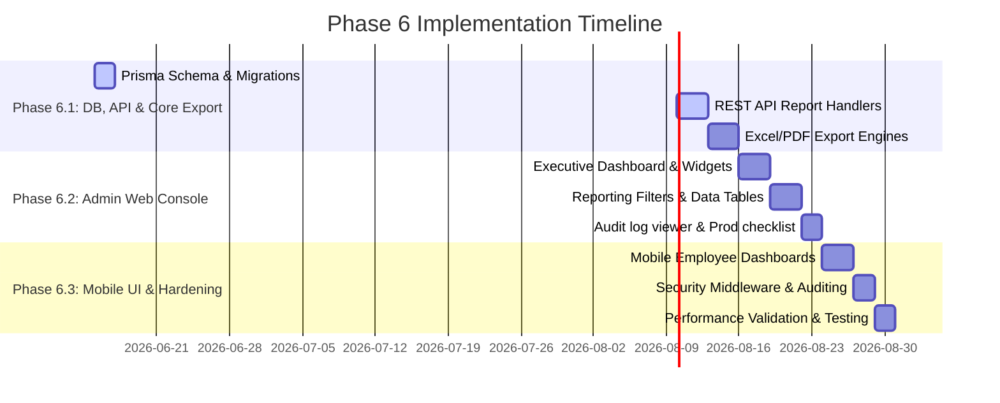

# PHASE 6 DESIGN: Reporting, Analytics, Auditing & Production Readiness

This document defines the comprehensive architecture and design specifications for Phase 6 of the **AHH WFM** suite. It covers executive intelligence, reporting pipelines, file exporting engines, security-compliant audit tracking, role-based reporting permissions, and production-ready checklist systems.

---

## 1. Executive Dashboard Architecture

The Executive Dashboard acts as the system's strategic cockpit, consolidating real-time operations, financial metrics, compliance indicators, and system health status.

### A. Dashboard Metrics Deck
- **Workforce Headcount Summary**:
  - Total Active Headcount, New Hires (Current Month), Deactivations (Current Month).
  - Breakdown by worker class (Staff vs. Laborer) and location.
- **Active/Inactive Status**:
  - Live count of checked-in operatives (On Duty) vs. checked-out/inactive operatives (Offline, On Break, On Leave).
- **Department Distribution**:
  - Visual share percentage and headcounts mapped across Engineering, Operations, Logistics, HR, and Operations.
- **Attendance Compliance**:
  - Daily check-in compliance percentage: \(\text{Compliance Rate} = \frac{\text{Actual Check-Ins}}{\text{Expected Scheduled Check-Ins}} \times 100\).
  - Lateness trends and Out-of-Zone alert counts.
- **Leave Utilization**:
  - Aggregate leaves taken, pending approvals count, and average approval lifecycle duration.
- **Overtime Cost Summary**:
  - Cost calculations in QAR grouped by standard, weekend, holiday, and night shift overtime rates.
- **SAP Sync Health**:
  - Live API status node, job success rate (\(> 99.5\%\)), and dead-letter/retry queue depth.

### B. UI Component Composition
- **Visual Grid**: Multi-card grid styling using deep background cards, micro-trends indicators (e.g. `+2.4% vs last week`), and reactive SVG charts.
- **Refresh Control**: Automatic cache polling (5 minutes interval) with a manual "Force Refresh" button.

---

## 2. Report Specifications & Schema Mappings

We define five distinct report domains, each querying core database tables with dynamic aggregation logic.

| Report Type | Primary Data Origin | Computed / Calculated Fields |
| :--- | :--- | :--- |
| **Attendance Reports** | `AttendanceRecord`, `Worksite`, `Employee` | - **Lateness Duration**: Actual Check-In vs Scheduled Shift Start.<br>- **Zone Offset Distance**: Computed distance to worksite perimeter via Haversine.<br>- **Abscence Status**: Triggered when ShiftAssignment exists without corresponding AttendanceRecord. |
| **Leave Reports** | `LeaveRequest`, `LeaveType`, `LeaveBalance` | - **Leave Deductible Days**: Calendar days minus weekends/holidays.<br>- **Leave Liability (QAR)**: \(\text{Liability} = \text{Remaining Balance} \times \frac{\text{Daily Wage}}{30}\).<br>- **Department Trend Indices**: Departmental utilization averages. |
| **Overtime & Payroll** | `SapPayrollStage`, `OvertimeRate`, `AttendanceRecord` | - **OT Premium Amount (QAR)**: Actual OT Minutes \(\times\) Multiplier \(\times\) Base Hourly Rate.<br>- **Wage Type Code Allocation**: Mapping output based on time brackets and holidays.<br>- **Lock History Integrity**: Checksums validating staged values. |
| **Shift & Scheduling** | `ShiftAssignment`, `ShiftTemplate`, `ConflictLog` | - **Coverage Gap Headcount**: Scheduled required count vs assigned headcount.<br>- **Swap Variance Rate**: Swaps count per employee cohort.<br>- **Understaffing Risk Factor**: Alerts on negative headcount gaps. |
| **SAP Integration** | `SapSyncJob`, `SapExportQueue`, `SapReconciliationLog` | - **Transfer Latency**: Job completion time minus queue entry time.<br>- **Sync Integrity Delta**: Discrepancies between local hours vs SAP-reported OData hours.<br>- **DLQ Status Tracker**: Count of retried/failed items. |

---

## 3. Database Proposal (New Schema Tables)

To support saved states, filter defaults, export auditing, and system logs, we propose the following schema additions to `schema.prisma`.

```prisma
// 1. Saved Report Configurations and Filters
model SavedReport {
  id            String   @id @default(uuid())
  name          String
  reportType    String   // e.g., "ATTENDANCE", "LEAVE", "PAYROLL"
  description   String?
  filterJson    String   @db.Text // Stringified filter criteria (departments, dates, cost centers)
  createdById   String
  createdBy     Employee @relation("UserSavedReports", fields: [createdById], references: [id])
  createdAt     DateTime @default(now())
  updatedAt     DateTime @updatedAt

  @@index([createdById])
  @@index([reportType])
}

// 2. Report Export History for security auditing
model ReportExportLog {
  id            String   @id @default(uuid())
  reportName    String
  exportType    String   // "PDF", "EXCEL", "CSV"
  filterJson    String   @db.Text
  recordCount   Int
  downloadedById String
  downloadedBy  Employee @relation("ReportDownloads", fields: [downloadedById], references: [id])
  ipAddress     String
  userAgent     String
  timestamp     DateTime @default(now())

  @@index([downloadedById])
  @@index([timestamp])
}

// 3. System Activity Logs for Auditing & Compliance
model UserActivityLog {
  id            String   @id @default(uuid())
  userId        String
  user          Employee @relation("UserActivity", fields: [userId], references: [id])
  action        String   // e.g., "PAYROLL_LOCK", "SHIFT_SWAP_APPROVE", "MAPPING_UPDATE"
  module        String   // e.g., "PAYROLL", "SCHEDULING", "INTEGRATION"
  description   String   @db.Text
  ipAddress     String
  userAgent     String
  metadata      String?  @db.Text // Detailed JSON payload changes (diff representation)
  timestamp     DateTime @default(now())

  @@index([userId])
  @@index([module])
  @@index([action])
  @@index([timestamp])
}

// 4. Production Readiness Checklists Results log
model ProductionCheckLog {
  id            String   @id @default(uuid())
  checkKey      String   @unique // e.g., "ENV_VARIABLES_VERIFIED", "DB_BACKUP_TESTED"
  status        String   // "PASSED", "WARNING", "FAILED"
  checkedById   String
  checkedBy     Employee @relation("ProdChecks", fields: [checkedById], references: [id])
  notes         String?  @db.Text
  updatedAt     DateTime @updatedAt
}
```

---

## 4. REST API Proposal (`/api/v1/*`)

All reporting and logging endpoints will follow REST guidelines and accept queries for filtering.

### A. Executive Dashboard Analytics
- **`GET /api/v1/reports/executive`**
  - **Query Parameters**: `period` (YYYY-MM), `departmentId`
  - **Response Payload**:
    ```json
    {
      "period": "2026-06",
      "summary": {
        "totalHeadcount": 142,
        "activeOnDuty": 98,
        "complianceRate": 94.5,
        "totalOvertimeCost": 34850.00,
        "sapSyncSuccessRate": 99.8
      },
      "departmentBreakdown": [
        { "name": "Operations", "count": 65, "pct": 45.7 },
        { "name": "Logistics", "count": 42, "pct": 29.5 }
      ]
    }
    ```

### B. Specialized Report Data Fetching
- **`GET /api/v1/reports/attendance`**: Fetches late arrivals, absences, and out-of-zone occurrences.
  - **Filters**: `startDate`, `endDate`, `departmentId`, `employeeId`, `worksiteId`, `status`
- **`GET /api/v1/reports/leaves`**: Fetches balance utilizations and liabilities.
  - **Filters**: `startDate`, `endDate`, `departmentId`, `leaveTypeId`
- **`GET /api/v1/reports/overtime`**: Fetches approved/pending OT records and staging wage codes.
  - **Filters**: `period`, `departmentId`, `isApproved`, `wageType`
- **`GET /api/v1/reports/shifts`**: Fetches scheduling coverage, overstaffing warnings, and swap counts.
  - **Filters**: `startDate`, `endDate`, `departmentId`
- **`GET /api/v1/reports/sap`**: Queries export queues, failed syncs, and reconciliation discrepancies.
  - **Filters**: `status`, `jobId`, `module`

### C. Report Export Engine
- **`POST /api/v1/reports/export`**
  - **Request Body**:
    ```json
    {
      "reportName": "Late Arrival Audit Report",
      "reportType": "ATTENDANCE",
      "exportFormat": "PDF", // "EXCEL" | "CSV"
      "filters": {
        "startDate": "2026-06-01T00:00:00Z",
        "endDate": "2026-06-13T00:00:00Z",
        "departmentId": "DEP-OPS"
      }
    }
    ```
  - **Behavior**: Saves an audit record in `ReportExportLog`, converts dataset stream into requested mime-type, and pipes output as downloadable media.

### D. Audit Log Viewer
- **`GET /api/v1/audit/logs`**
  - **Query Parameters**: `module`, `action`, `startDate`, `endDate`, `userId`, `limit`, `offset`

---

## 5. Web UI Design Specifications

### A. Reports Module & Dashboard Layout
- **Navigation Node**: Introduce `/reports` containing a sidebar index (Executive, Attendance, Leaves, Overtime, Shifts, SAP, Activity Audit).
- **Executive Board Layout**:
  - Live metric widgets displaying primary operation indicators.
  - Line-graphs tracking daily attendance compliance.
  - Cost breakdowns displayed as comparative horizontal progress bars.
- **Reporting Table Canvas**:
  - **Filter Configuration Drawer**: Collapsible panel supporting Date-range selectors, Department dropdowns, Cost Center filters, and Status checkboxes.
  - **Save Filter Widget**: Text-input triggers to bookmark current query criteria to `SavedReport`.
  - **Action Header**: Export dropdown buttons with PDF, Excel, and CSV labels.
  - **Audit Viewer Page**: Clean search grid showcasing historic database alterations, side-by-side JSON diffs (before/after values), and user IP tracking tags.
  - **Production Readiness Dashboard**: Toggle list displaying state checks (Backup, TLS, Secrets config) with verification triggers.

---

## 6. Mobile UI Design Specifications

All reporting logs are adapted for employee viewports, matching the maroon/bronze simulator chassis themes.

- **My Attendance Analytics (`/reports/my-attendance`)**: Month-to-date lateness minutes counter, total days checked-in on-time, and out-of-zone validation warning history.
- **My Leave Ledger (`/reports/my-leaves`)**: Interactive balance cards showing starting quotas, days consumed, pending days, andcarried-over days. Includes a chronological transaction ledger.
- **My Overtime Claims (`/reports/my-overtime`)**: Total calculated minutes split by multiplier category (e.g., standard vs weekend) and review approval states.
- **My Schedule Timeline (`/reports/my-roster`)**: Mapped calendar showcasing rosters, shift lengths, split hours, and swap validation histories.

---

## 7. Role-Based Access Control Matrix (RBAC)

To prevent security leaks, dataset exposure is strictly enforced at both the API and UI middleware boundaries.

| Reporting Module | Admin Role | HR Role | Finance Role | Supervisor Role | Employee Self-Service |
| :--- | :--- | :--- | :--- | :--- | :--- |
| **Executive Summary** | Read/Export | Read Only | Read Only | No Access | No Access |
| **Attendance Reports** | Read/Export | Read/Export | Read Only | Team Only | Self Only |
| **Leave Reports** | Read/Export | Read/Export | Read Only | Team Only | Self Only |
| **Overtime & Payroll** | Read/Export | Read Only | Read/Export | Team Only (Hrs) | Self Only (Hrs) |
| **Shift/Roster Coverage** | Read/Export | Read/Export | No Access | Team Only | Self Only |
| **SAP Inbound/Outbound** | Read/Retry | Read Only | Read Only | No Access | No Access |
| **Activity Audit Logs** | Read Only | No Access | No Access | No Access | No Access |

---

## 8. Audit and Security Compliance Specifications

- **Action Logging Middleware**: Intercepts structural mutations (PUT, POST, DELETE) targeting business logic (shifts, leaves, overtime rates, and connections), storing action records in `UserActivityLog`.
- **Secret Protection**: Payloads containing keys, integration connection tokens, or user passwords must be completely omitted or masked (e.g., `********`) in logging.
- **PII Data Security**: Reports containing employee phone numbers, salaries, or emails must run under TLS, and files exported must log downloaded coordinates (IP, userAgent, downloadedById) in `ReportExportLog`.

---

## 9. Production Readiness & Environment Configuration

### A. Environment Configuration Checklist
Ensure the following variables are defined in the runtime vault/environment before launch:
- `NODE_ENV="production"`
- `DATABASE_URL` (High availability MySQL production cluster connection string)
- `NEXTAUTH_SECRET` (Securely generated crypt value)
- `NEXTAUTH_URL` (Canonical production DNS address)
- `SAP_ODATA_CREDENTIALS_VAULT_REF` (Production integration credentials)

### B. MySQL Hardening & Optimization
- **Connection Limits**: Configure max pool size according to cluster capability: `connection_limit=50`.
- **Indexing Strategy**: Ensure indices are provisioned on `employeeId`, `date`, `status`, `payrollPeriod`, and foreign keys.
- **Backups**: Daily automated snapshot cycles (AWS RDS or equivalent backups) retaining archives for 30 days.

### C. Logging, Error Tracking & Containerization
- **Logging Pipeline**: Use Winston or Pino logger writing stdout JSON streams for container capture.
- **Docker Multi-Stage Compilation**: Separate build layers to compile lightweight standalone Next.js engines.
- **Sentry Integration**: Configure centralized exception catches to alert engineers on backend errors.

---

## 10. Estimated Implementation Phases

We schedule the implementation of Phase 6 across three distinct blocks:



### Phase 6.1: Database, Core API & Export Engine (5 Days)
- Apply database migrations for `SavedReport`, `ReportExportLog`, `UserActivityLog`, and `ProductionCheckLog`.
- Implement API controller routes processing filters, data aggregation queries, and SQL limits.
- Build file stream compilers generating standard PDF, Excel, and CSV payloads with proper headers.

### Phase 6.2: Web Console Reporting Suite (8 Days)
- Construct Web Executive Dashboard panels.
- Build standard reporting data tables with dynamic filter sidebars.
- Create system log viewer page with JSON-diff components.

### Phase 6.3: Mobile Self-Service & Security Hardening (7 Days)
- Build mobile reporting screens for operatives.
- Set up audit middleware hooks registering security-compliant logs.
- Perform high-load query testing, indexing checks, and complete the production checklists.
