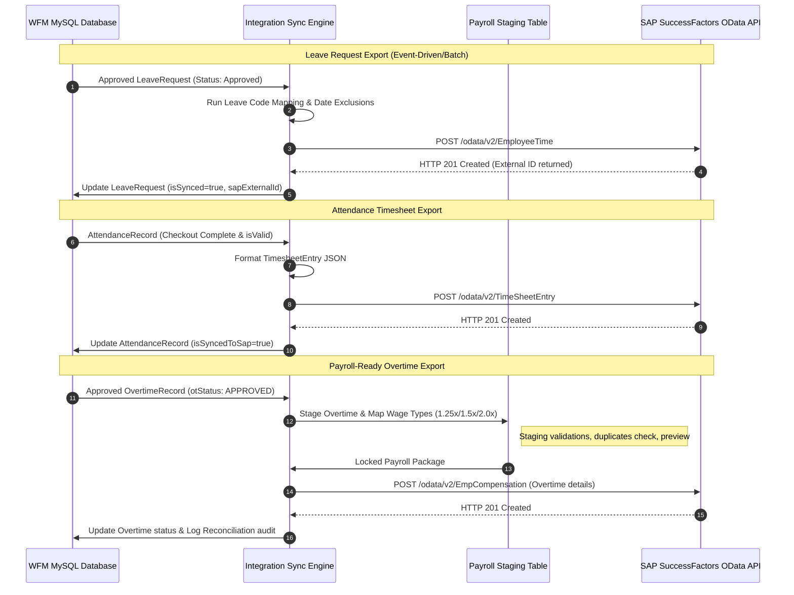

# SAP SuccessFactors Operational Sync — Phase 5B Design

This document outlines the detailed technical specifications and architectural design for Phase 5B: SAP Operational Sync, expanding the AHH WFM integration hub to support live bidirectional transactional data exchange.

---

## 1. System Architecture & Data Flow

Below is the transactional data flow highlighting the outbound pipelines for leaves, attendance, overtime, and roster schedules:



---

## 2. Sync Modules Specifications

### 2.1 Leave Synchronization
*   **Export Pipeline:** Syncs approved `LeaveRequest` records to SAP `EmployeeTime` OData entities.
*   **Cancellation and Rejections:** Handles cancellations (submitting deletion requests `DELETE /odata/v2/EmployeeTime('id')`) or rejections (reverting/deleting SAP records).
*   **Code Mapping:** Matches local categories to SAP codes:
    *   `LTYPE-ANNUAL` $\rightarrow$ SAP Code: `1001` (Annual Vacation)
    *   `LTYPE-SICK` $\rightarrow$ SAP Code: `2002` (Paid Sick Leave)
    *   `LTYPE-EMERGENCY` $\rightarrow$ SAP Code: `3003` (Compassionate Leave)
    *   `LTYPE-BUSINESS` $\rightarrow$ SAP Code: `4004` (Business Trip)

### 2.2 Attendance Synchronization
*   **Export Timesheets:** Formats daily `AttendanceRecord` objects into SAP `TimeSheetEntry` payloads.
*   **Correction Synchronisation:** Sends original and corrected clock-in/out records along with manager approval details.
*   **Geofence Exclusions:** Flags `OUT_OF_ZONE` check-ins to alert SAP payroll administrators for review.

### 2.3 Overtime Synchronization
*   **Strict Approval Filter:** Only exports records with `otStatus = "APPROVED"`.
*   **Wage Type Mapping:** Maps categories to SAP wage components:
    *   Standard Overtime (`1.25x`) $\rightarrow$ Wage Type: `WT_OT_STD`
    *   Weekend Overtime (`1.5x`) $\rightarrow$ Wage Type: `WT_OT_WKD`
    *   Holiday Overtime (`2.0x`) $\rightarrow$ Wage Type: `WT_OT_HOL`
    *   Night Overtime (`1.25x`) $\rightarrow$ Wage Type: `WT_OT_NGT`
*   **Payroll Package:** Compiles aggregated hourly totals by employee ID for direct ingestion by SAP Payroll modules.

### 2.4 Shift & Roster Synchronization
*   **Scheduling Board Export:** Synchronizes `ShiftAssignment` profiles to keep SuccessFactors calendars updated.
*   **Shift Swap Export:** Registers bilateral swaps after approvals, shifting shift codes dynamically in SAP.

---

## 3. Database Proposal (Additional Models)

To support transactional sync tracking, payroll staging, and reconciliation audits, we propose adding the following models to `packages/database/prisma/schema.prisma`:

```prisma
model SapExportQueue {
  id            String      @id @default(uuid())
  module        String      // "LEAVE" | "ATTENDANCE" | "OVERTIME" | "ROSTER"
  recordId      String      // Reference to source WFM record (e.g. LeaveRequest.id)
  payload       String      @db.Text
  status        String      @default("PENDING") // "PENDING" | "PROCESSING" | "SENT" | "FAILED"
  retryCount    Int         @default(0)
  lastError     String?     @db.Text
  createdAt     DateTime    @default(now())
  updatedAt     DateTime    @updatedAt
}

model SapPayrollStage {
  id              String      @id @default(uuid())
  employeeId      String
  payrollPeriod   String      // e.g. "2026-06"
  wageType        String      // e.g. "WT_OT_STD", "WT_OT_WKD"
  calculatedHours Float
  calculatedPay   Float       // Base currency QAR
  isApproved      Boolean     @default(false)
  isExported      Boolean     @default(false)
  exportedJobId   String?
  createdAt       DateTime    @default(now())
  updatedAt       DateTime    @updatedAt
  
  @@unique([employeeId, payrollPeriod, wageType])
}

model SapReconciliationLog {
  id            String      @id @default(uuid())
  employeeId    String
  period        String      // e.g. "2026-06"
  module        String      // "LEAVE" | "ATTENDANCE" | "OVERTIME"
  wfmHours      Float       // Local WFM record sum
  sapHours      Float       // Queried SAP OData sum
  discrepancy   Float       // Math difference (WFM - SAP)
  status        String      @default("MATCHED") // "MATCHED" | "DISCREPANCY" | "RESOLVED"
  comments      String?     @db.Text
  createdAt     DateTime    @default(now())
  updatedAt     DateTime    @updatedAt
}
```

---

## 4. REST API Design (Outbound Sync Actions)

### 4.1 `POST /api/v1/sap/export/leaves`
Manually triggers the export of pending, approved leave requests to SuccessFactors.
*   **Body Payload:** `{ "requestIds": ["leave-uuid-1", "leave-uuid-2"] }` (or empty to auto-scan all pending).

### 4.2 `POST /api/v1/sap/export/attendance`
Ingests daily attendance and geofence-compliance timesheets to SAP.

### 4.3 `POST /api/v1/sap/export/overtime`
Generates payroll compilation packages for approved overtime values.

### 4.4 `POST /api/v1/sap/export/shifts`
Exports monthly workforce schedule assignments.

### 4.5 `GET /api/v1/sap/reconciliation`
Returns list of reconciliation audits highlighting discrepancies between WFM and SAP.

### 4.6 `GET/POST /api/v1/sap/payroll`
*   `GET` — Retrieves payroll-ready overtime staging summaries.
*   `POST` — Approves/locks period summaries and triggers export to SAP Employee Central Payroll.

---

## 5. User Interface (SAP Operations Command Console)

The Web Dashboard under `/sap` will expand to include an **Operations Dashboard**:
1.  **Payroll Export Preview:** Lists calculated overtime summaries before export, allowing administrators to filter by cost center, inspect QAR pay amounts, and click **Approve & Lock Package**.
2.  **Pending Exports Queue:** Live list of records waiting to sync. Includes checkbox selectors to manually trigger synchronization.
3.  **Reconciliation Inspector:** Compares local WFM database sums against queried SAP OData records side-by-side, flagging items with mismatching hours (discrepancy $\neq 0.00$) in Red.
4.  **Error DLQ Console:** Allows admins to edit payloads of blocked records (e.g. fixing mapped cost centers) and click **Retry Export**.

---

## 6. Testing Strategy

To ensure zero payroll errors during sync, we will implement the following tests:
*   **Sandbox End-to-End Validation:** Run end-to-end syncs of leaves, attendance, and overtime calculations against SuccessFactors Sandbox API endpoints.
*   **Failure Simulation Tests:** Mock network dropouts during timesheet exports to verify records are safely queued in `SapExportQueue` and no duplicate records are generated on retry.
*   **Discrepancy Checks:** Verify the reconciliation calculations detect discrepancy flags when SAP balances and local WFM logs diverge.
*   **High-Volume Stress Testing:** Benchmark batch exports of 2,000+ attendance logs to verify batch updates run in parallel within under 10 seconds.

---

## 7. Risk Assessment & Mitigations

*   **Risk: Double Payment (Duplicate exports).**
    *   *Mitigation:* The `SapPayrollStage` table enforces a unique constraint on `@@unique([employeeId, payrollPeriod, wageType])`. Duplicate entries are blocked at the database level.
*   **Risk: Data drift (Manual adjustments in SAP).**
    *   *Mitigation:* Reconciliation jobs poll SAP APIs weekly and flag discrepancy items in the WFM admin dashboard for manual audit.
*   **Risk: Compliance (PII Data Leakage).**
    *   *Mitigation:* Log streams strip out name/phone identifiers, keeping transaction logs strictly aligned to employee corporate ID keys.
