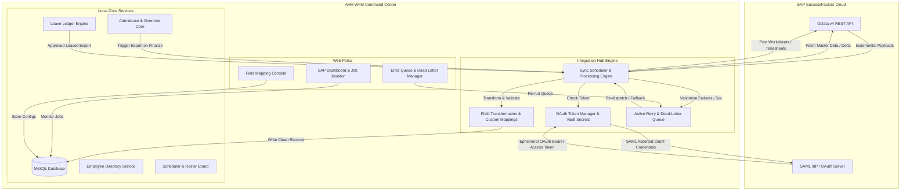

# SAP SuccessFactors Integration Hub — Phase 5 Design

This document details the production-ready architecture for integrating **AHH WFM** with **SAP SuccessFactors**. It defines the sync processes, security protocols, schema enhancements, API schemas, and administration consoles required to support bidirectional sync of employee directory, leaves, attendance, schedules, and payroll-ready overtime data.

---

## 1. System Architecture Diagram

Below is the conceptual architecture showcasing the event-driven integration layer, synchronization engines, queueing structures, and secure connectivity boundaries:



---

## 2. Integration Scope & Synchronization Pipelines

### 2.1 Employee Master Data & Org Structure Sync (Inbound)
*   **Organizational Hierarchy Mapping:** Pulls organizational data (`BusinessUnit`, `Division`, `Department`, `CostCenter`, `Location`, and reporting supervisor lines) and aligns them to local WFM segments.
*   **Employee Master Sync:** Updates local accounts on additions, contract renewals, profile updates, or deactivations. Deactivations dynamically flag employees as inactive (`isActive = false`) locally, which triggers scheduling guards to block future shift assignments.

### 2.2 Leave Management Sync (Outbound & Inbound)
*   **Leaves Export:** Local approved leaves are exported to SuccessFactors via `EmployeeTime` OData entities.
*   **Balances Sync:** Periodic imports of remaining leave balances from SAP (overwriting local balance records with SAP as the system of record).
*   **Leave Type Mapping:** Translates local leave categories (e.g. `WF-ANNUAL`, `WF-SICK`) into SAP-specific pay codes.

### 2.3 Attendance & Overtime Sync (Outbound)
*   **Attendance Export:** Sends geofence-validated attendance events (clock-in, clock-out, lateness duration) to SAP Timesheets (`TimeSheetEntry`).
*   **Overtime Export:** Pushes approved overtime records strictly after supervisor sign-off (`otApprovedMinutes` > 0). Calculated minutes are matched to SAP codes (`OVERTIME_125`, `OVERTIME_150`, `OVERTIME_200`) based on rates.

### 2.4 Schedule Roster Sync (Bidirectional)
*   **Shift Planners Sync:** Exports finalized workforce planning shifts to SAP for operational auditing.

---

## 3. Integration & Security Architecture

### 3.1 OAuth 2.0 with SAML Bearer Assertion
SuccessFactors secures its REST OData API using SAML assertion-based OAuth. AHH WFM logs in without manual user interaction using the following flow:
1.  **Private Key Storage:** A locally generated certificate's private key is registered in a secure credentials vault (e.g. Windows Credentials Manager or encrypted local env configurations). The public certificate is uploaded into SuccessFactors.
2.  **SAML Assertion Generation:** The integration engine generates a SAML 2.0 Token request XML containing the Client ID, User ID, and Assertion expiration, signing the payload with the private key.
3.  **Token Exchange:** AHH WFM posts the SAML assertion to the SAP OAuth endpoint `/oauth/token`. SuccessFactors validates the signature against the uploaded public certificate and returns an ephemeral bearer token.
4.  **Bearer Header:** The token is cached in memory and included in the HTTP headers (`Authorization: Bearer <token>`) of subsequent API calls.
5.  **Token Refresh Strategy:** Rather than refresh tokens, AHH WFM dynamically re-generates signed SAML assertions whenever the cached access token is within 5 minutes of expiring.

---

## 4. Field Mapping & Transformation Engine

To accommodate customized SAP fields, we implement a dynamic transformation mapping engine:

```
[SF Payload JSON] ──> [FieldMapping Match] ──> [Type Cast / Lookup] ──> [Validation Gate] ──> [MySQL Save]
```

### 4.1 Configuration Table Rules
*   **`sourceField`:** Path to values in the SAP OData payload (e.g., `personalInfo.lastName`).
*   **`targetField`:** Target column in the local MySQL database (e.g., `lastName`).
*   **`transformRule`:** Pre-built transform macros:
    *   `UPPERCASE` / `LOWERCASE` — Standardizes text inputs.
    *   `STRING_TO_INT` / `STRING_TO_FLOAT` — Safe parsing.
    *   `DATE_FORMAT(pattern)` — Standardizes timestamp formatting.
    *   `VALUE_MAP(JSON)` — Translates value codes (e.g. `{"M": "Morning", "E": "Evening"}`).
*   **`validationRules`:** Regex rules or limits (e.g., `IS_EMAIL`, `MAX_LENGTH(50)`, `NOT_NULL`).

---

## 5. Sync Processing & Error Handling

### 5.1 Synchronization Execution Modes
1.  **Full Sync:** Syncs all records. Executed during initial migration or system recoveries.
2.  **Incremental Sync:** Periodic sync using OData delta tokens (`$deltatoken`) or query parameters (e.g. `lastModifiedDateTime gt ...`) to fetch changes since the last run.
3.  **Scheduled Sync:** Automated cron tasks running incremental updates every hour and leave balance updates daily at midnight.
4.  **Manual Sync:** Admin triggers executed from the Command Center UI for specific modules or single employee IDs.

### 5.2 Fault Tolerance: Retry & Dead-Letter Queue
To handle network dropouts and transient server load issues, we establish a queueing pipeline:

```
[Integration Failures] ──> [Check Retry Limit (max=3)] 
                                ├── (Under Limit) ──> [Wait with Exponential Backoff] ──> [Re-dispatch Queue]
                                └── (Over Limit)  ──> [Write to Dead-Letter Queue (DLQ)] ──> [Admin Alert]
```

*   **Validation Failures:** Non-transient errors (e.g., missing mandatory department links) bypass retries and go directly to the Dead-Letter Queue for administrator intervention.
*   **Partial Sync Failures:** Handled inside atomic transaction wrappers. If a batch of 50 records contains 1 failed insertion, the remaining 49 are saved, while the single failure is isolated and pushed to the Retry Queue.

---

## 6. Database Schema Proposal

We propose adding the following models to `packages/database/prisma/schema.prisma` to support Phase 5:

```prisma
model SapConnection {
  id                String    @id @default(uuid())
  systemName        String    @unique // e.g. "SF-QAS", "SF-PROD"
  odataUrl          String
  clientId          String
  companyId         String
  userId            String    // Dedicated system sync user
  privateKeyVaultId String    // Reference identifier inside private keys storage vault
  isActive          Boolean   @default(true)
  createdAt         DateTime  @default(now())
  updatedAt         DateTime  @updatedAt
  syncJobs          SapSyncJob[]
}

model SapSyncJob {
  id              String       @id @default(uuid())
  connectionId    String
  connection      SapConnection @relation(fields: [connectionId], references: [id])
  module          String       // "EMPLOYEE", "LEAVE", "ATTENDANCE", "OVERTIME", "ROSTER"
  syncType        String       // "FULL", "INCREMENTAL", "MANUAL"
  status          String       // "PENDING", "PROCESSING", "COMPLETED", "FAILED"
  recordsProcessed Int         @default(0)
  recordsSucceeded Int         @default(0)
  recordsFailed    Int         @default(0)
  startedAt       DateTime     @default(now())
  completedAt     DateTime?
  errorMessage    String?      @db.Text
  deltaToken      String?      // OData delta token for future incremental syncs
  logs            SapSyncLog[]
}

model SapSyncLog {
  id            String      @id @default(uuid())
  jobId         String
  job           SapSyncJob  @relation(fields: [jobId], references: [id], onDelete: Cascade)
  severity      String      // "INFO", "WARN", "ERROR"
  entityName    String?     // e.g. "Employee", "AttendanceRecord"
  entityId      String?     // External key reference
  message       String      @db.Text
  createdAt     DateTime    @default(now())
}

model SapFieldMapping {
  id            String      @id @default(uuid())
  module        String      // "EMPLOYEE", "LEAVE", "ATTENDANCE"
  sourceField   String      // SAP JSON path
  targetField   String      // WFM Schema property
  transformRule String?     // Transformation macro
  validationRules String?   // Semicolon-separated validation tags
  isRequired    Boolean     @default(false)
  isActive      Boolean     @default(true)
  createdAt     DateTime    @default(now())
  updatedAt     DateTime    @updatedAt
}

model SapRetryQueue {
  id            String      @id @default(uuid())
  module        String      // "LEAVE", "ATTENDANCE", "OVERTIME"
  entityId      String      // Local record ID to push
  payload       String      @db.Text // Encrypted backup of request parameters
  retryCount    Int         @default(0)
  nextAttemptAt DateTime
  lastError     String?     @db.Text
  status        String      @default("PENDING") // "PENDING", "FAILED_DLQ", "RESOLVED"
  createdAt     DateTime    @default(now())
  updatedAt     DateTime    @updatedAt
}
```

---

## 7. REST API Design

### 7.1 `POST /api/v1/sap/sync`
Triggers a manual synchronization job for a specific module.
*   **Body Payload:**
    ```json
    {
      "module": "EMPLOYEE",
      "syncType": "INCREMENTAL",
      "employeeId": "EMP2026101" // Optional filter
    }
    ```
*   **Response (202 Accepted):**
    ```json
    {
      "jobId": "job-uuid-12345",
      "status": "PENDING",
      "message": "SAP sync job queued successfully."
    }
    ```

### 7.2 `GET /api/v1/sap/jobs`
Lists historic and active sync jobs with metrics.
*   **Query Parameters:** `module`, `status`, `limit`, `offset`.
*   **Response (200 OK):**
    ```json
    {
      "jobs": [
        {
          "id": "job-uuid-12345",
          "module": "EMPLOYEE",
          "syncType": "INCREMENTAL",
          "status": "COMPLETED",
          "recordsProcessed": 142,
          "recordsSucceeded": 140,
          "recordsFailed": 2,
          "startedAt": "2026-06-12T23:00:00Z",
          "completedAt": "2026-06-12T23:02:15Z"
        }
      ]
    }
    ```

### 7.3 `GET /api/v1/sap/logs`
Retrieves granular log trails for diagnostic research.
*   **Query Parameters:** `jobId`, `severity`, `entityId`.

### 7.4 `GET/POST/PUT /api/v1/sap/mappings`
Manages the transformation mappings configuration database.

### 7.5 `POST /api/v1/sap/retry`
Manually forces immediate re-dispatch of items sitting in the retry queue or dead-letter queue.

---

## 8. Command Center Web UI Admin Mockup Layouts

The Command Center Web UI under apps/web will add a dedicated path `/sap` containing:
1.  **Integration Summary Board:** Real-time diagnostics detailing connection state, last successful sync timestamps, sync success percentages, and job run time graphs.
2.  **Job History Table:** Searchable list of jobs showing rows with color-coded badges (`COMPLETED` in Green, `FAILED` in Red, `PROCESSING` in Pulse Blue).
3.  **Active Mapping Manager:** Grid interface matching source JSON attributes to destination columns with dropdown selection of transformation formulas.
4.  **Errors Queue & DLQ Monitor:** Cards detailing failed entities, failure causes (e.g. `Validation Failure: Email must be unique`), and buttons to either **Retry Now** or **Discard**.

---

## 9. Initial Data Migration Strategy

To transition safely to SAP SuccessFactors as the primary system of record, we follow this sequence:
1.  **Database Backup:** Create a full snapshot of the existing MySQL database.
2.  **Dry-run Validation:** Pull employee schemas from SAP without saving them, running the payload against the mapping validations to log any anomalies (e.g. duplicate emails, blank phone formats) into a pre-migration spreadsheet.
3.  **Target Seeding (Conflict Mitigation):**
    *   If a user exists in both databases, SuccessFactors values overwrite local values.
    *   SAP User ID becomes the master local `id`. Local keys are linked to the external SAP key to prevent duplication.
4.  **Rollback Plan:** If migration results in schema corruption or high error rates, the integration client is disabled, and the system reverts to the database snapshot.

---

## 10. Risk Assessment & Testing Strategy

### 10.1 Key Integration Risks & Mitigations

| Risk Event | Severity | Mitigation Strategy |
| :--- | :--- | :--- |
| **API Rate Limits** | High | Implement local throttling matching SAP rate rules (e.g. max 40 requests/sec). Cache OAuth tokens in memory. |
| **Data Schema Drift** | Medium | The field mapping engine isolates schema changes. If SAP changes a field name, it is updated in `/sap/mappings` without modifying the core codebase. |
| **PII Data Exposure** | High | Encrypt payload strings in the `SapRetryQueue` table using AES-256. Secure sync logs to prevent writing passwords or PII. |

### 10.2 Testing Strategy
*   **Sandbox Testing:** Utilize the SuccessFactors Sandbox API endpoint for verifying all schema mapping transformations.
*   **Failure Simulation:** Verify the integration engine handles connection failures, token expiration, HTTP 503 Service Unavailable, and data validation errors gracefully without crashing the core WFM application.
*   **Performance Benchmarking:** Test batch imports of 5,000+ employees to confirm database writes are executed using fast batch inserts instead of individual queries.
