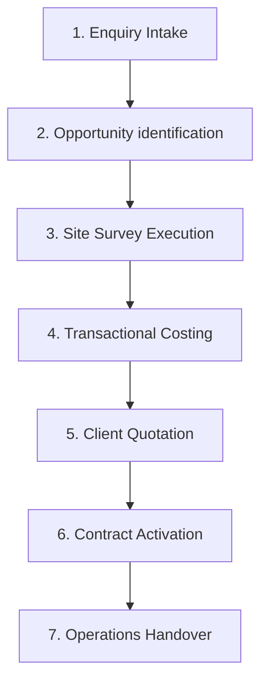

# Commercial Lifecycle Specification

This document maps out the seven stages of the commercial lifecycle in the Al Hattab Holding Workforce Management (AHH WFM) system.

## 1. Enquiry Intake
*   **Purpose**: Log incoming customer service queries (e.g. "Needs 12 guards for Westside Plaza").
*   **Owner**: Sales Team.
*   **Outcome**: Capture core requirements, client company name, contact, and check for duplicates.

## 2. Opportunity Identification
*   **Purpose**: Qualify the enquiry and evaluate potential value, probability, and fit.
*   **Owner**: Sales / Account Manager.
*   **Outcome**: Creation of an Opportunity record with estimated annual contract value (ACV) and stage progression trackers.

## 3. Site Survey Execution
*   **Purpose**: Conduct physical site audits to capture security risks, patrol routes, checklist items, and manpower requirements.
*   **Owner**: Operations Surveyor.
*   **Outcome**: Completed survey response templates and logged site conditions.

## 4. Transactional Costing
*   **Purpose**: Calculate manpower costs, relievers (rest days, public holidays, leave coverage), materials, overheads, and target profit margins.
*   **Owner**: Estimators & Finance.
*   **Outcome**: Compliant cost package with margin audit compliance score.

## 5. Client Quotation
*   **Purpose**: Compile structural costing models into formal customer proposals and rate card files.
*   **Owner**: Sales & Legal.
*   **Outcome**: Quotation document versioned, audited, and submitted to the client for review.

## 6. Contract Approval & Activation
*   **Purpose**: Review signed quotes, run legal approvals, audit system attachments, and activate the contract in the database.
*   **Owner**: Legal Counsel / Admin.
*   **Outcome**: Approved and ACTIVE ManpowerContract.

## 7. Operations Handover
*   **Purpose**: Hand over active contract terms, worksite requirements, and schedules to operations team.
*   **Owner**: Operations Team.
*   **Outcome**: Workforce roster scheduling begins; guards are deployed.
