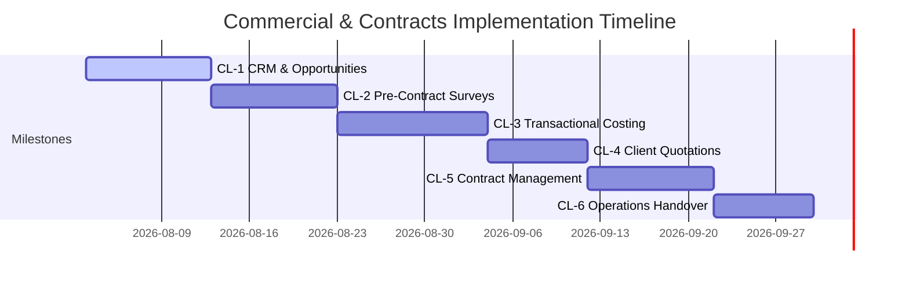

# Implementation Phases

This document details the milestone plan and deliverables for subsequent phases of the Commercial & Contracts consolidation.

## Milestone CL-1: CRM & Opportunities
*   **Focus**: Customer intake and pipeline qualification.
*   **Deliverables**:
    *   CRM enquiry intake and qualification flow.
    *   Kanban boards for Opportunity pipeline tracking.
    *   Duplicate prospect company checking triggers.

## Milestone CL-2: Site Surveys & Audits
*   **Focus**: Operational site details capture.
*   **Deliverables**:
    *   Surveyor dispatch calendar and assignments screen.
    *   Site survey templates (Security vs. FM).
    *   Risk & Hazard registers with file attachment uploads.

## Milestone CL-3: Costing & Configuration
*   **Focus**: Rate cards, cost packages, and margins.
*   **Deliverables**:
    *   Cost builder UI (incorporates overtime, allowance, relievers).
    *   Rate card master ledgers.
    *   Margin calibration validation charts.

## Milestone CL-4: Client Quotations
*   **Focus**: Proposal compiler and negotiation versioning.
*   **Deliverables**:
    *   Proposal PDF generator engine.
    *   Version history panel with side-by-side diff logic.
    *   Legal clause exception approvals dashboard.

## Milestone CL-5: Contract Management
*   **Focus**: Legal activation and scope amendments.
*   **Deliverables**:
    *   Quotation-to-Contract promotion workflow.
    *   Addendum modification forms (ACTIVE contract restrictions).
    *   Contract deactivation / termination transaction logs.

## Milestone CL-6: Operations Handover & Reports
*   **Focus**: Deployment readiness and commercial reports.
*   **Deliverables**:
    *   Mobilisation transition lists and department checklists.
    *   Handover acceptance log with client sign-offs.
    *   Pipeline analytics reports and margin heatmaps.
